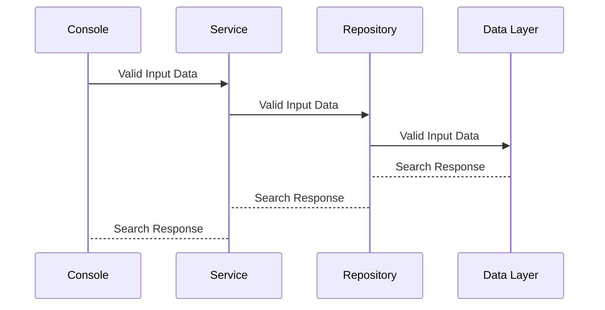

# Proximity Search

This is a console application which takes 4 arguments. 2 Keywords, an integer range and the filename. 
Application returns the number of times the keywords exist in the document within the given range, or 0 if the no match is found. The keywords themselves are considered to be part of the range. 

# Steps to execute the application

### Prerequisite
.Net Core 2.2

 1. Extract the zip to any location on your computer
 2. On command prompt type **cd {PATH_TO_THE_EXTRACTED_FILE}\Proximity.Search\Proximity.Search.Console\bin\Debug\netcoreapp2.2\publish\Version1.0**
 3. Type command "**dotnet.exe Proximity.Search.Console.dll the canal 6 input.txt**" (There are 2 sample files in Input folder for testing)
 

# Application Architecture

## Algorithm

### Steps in Algorithm

 1. Split the contents of Input file by ' ' assuming words are separated by whitespace and stored in String Array.
 2. Iterated over the string array with two conditions:
		 a. If the word matches Keyword 1 search for Keyword 2 in the range provided in input and increment the 		counter
		 b. If the word matches Keyword 2 search for Keyword 1 in the range provided in input and increment the counter
 3. Display the results on the console.

The application is written using SOLID Design Principles of Object Oriented Programming.

**Time Complexity** : O(n log n)
**Space Complexity:** O(n) (n is the no of words in the file)
**Cyclomatic Complexity of GetDataCount()**: 5
**Maintainability of Algorithm Project** : 91
readme.md
Displaying readme.md.
